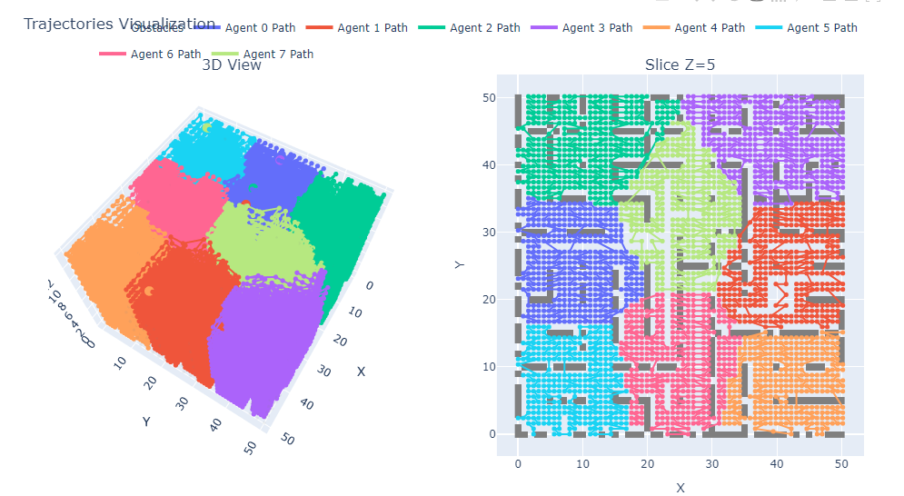
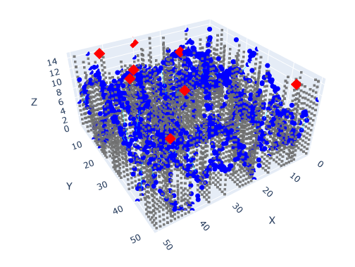
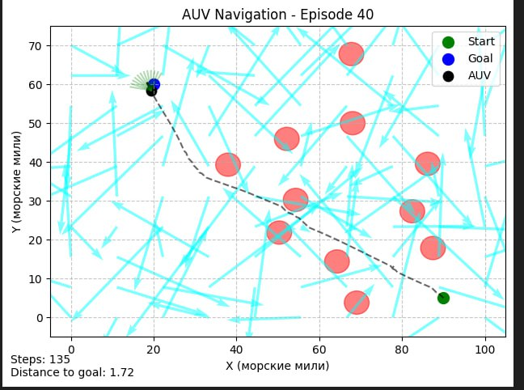
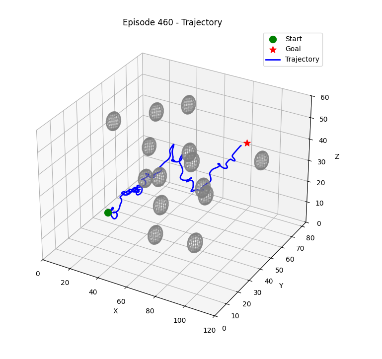

# DARP-3D: Dynamic 3D Environment for Autonomous Underwater Vehicles (AUV)

[](https://github.com/Master-Star-Field/DARP-3D)
[](https://opensource.org/licenses/MIT)

Проект **DARP-3D** представляет собой инструментарий для моделирования трёхмерных сред с препятствиями и течениями, оптимизации разделения пространства на сектора и планирования траекторий для автономных подводных аппаратов (АНПА). Реализованные алгоритмы позволяют решать задачи мультиагентного взаимодействия в условиях сложной гидродинамики.

---

## 🚀 Особенности проекта
- **3D-среды** с различными типами препятствий: сферы, подводные горы, лабиринты.
- **Гидродинамические модели** течений с настраиваемыми параметрами.
- **Алгоритмы секторизации**:
  - K-means с балансировкой и проверкой связности.
  - Распределение на основе потенциальных полей.
  - Волновой алгоритм с адаптацией к трёхмерной карте.
- **Адаптивные сетки** для построения траекторий (квадродеревья, деформируемые слои).
- **Планировщик траекторий** с змеевидным обходом и межслойными соединениями.
- **Обучение с подкреплением** (DQN, ND3QN) для управления АПА.
- Почти к каждому этапу работы приложен блокнот с возможность посмотреть работу при различных значениях параметров или попробывать реализовать свой алгоритм и проверить его с помощью функций визуализации
---

📂 Структура репозитория


📊 ## Визуализации

**Разделение на сектора**

 

Адаптивные сетки
<div align="center">   </div>
Обучение с подкреплением
<div align="center">   </div>


### Генерация горной местности
```py
mountain_map = generate_mountains(num_peaks=5, grid_size=(100, 100, 20))
```
## Создание лабиринта
```py
maze_structure = generate_maze(width=10, height=10, add_cycles=5)
maze_map = render_maze(maze_structure, cell_size=5, wall_height=2)
```
### Разделение на сектора
```py
from region_division import constrained_geodesic_kmeans
```
### Инициализация позиций агентов
```py
num_agents = 3
agent_positions = np.array([[x1, y1, z1], [x2, y2, z2], [x3, y3, z3]])
```

### Запуск алгоритма K-means с балансировкой
```py
regions = constrained_geodesic_kmeans(
    map_3d=combined_map,
    num_agents=num_agents,
    agent_positions=agent_positions,
    max_iterations=50
)
```
### Построение траекторий
```py
from planer import build_trajectories_by_sectors

# Оптимизация путей для агентов
trajectories = build_trajectories_by_sectors(
    map_3d=combined_map,
    regions=regions,
    agent_positions=agent_positions
)
```


## 📦 Установка
1. Клонируйте репозиторий:
   ```bash
   git clone https://github.com/Master-Star-Field/DARP-3D.git
   cd DARP-3D
